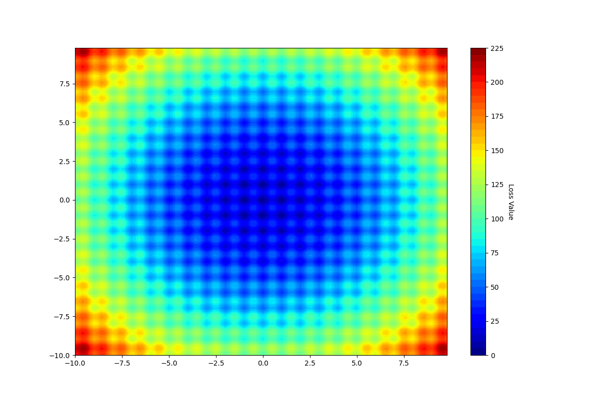
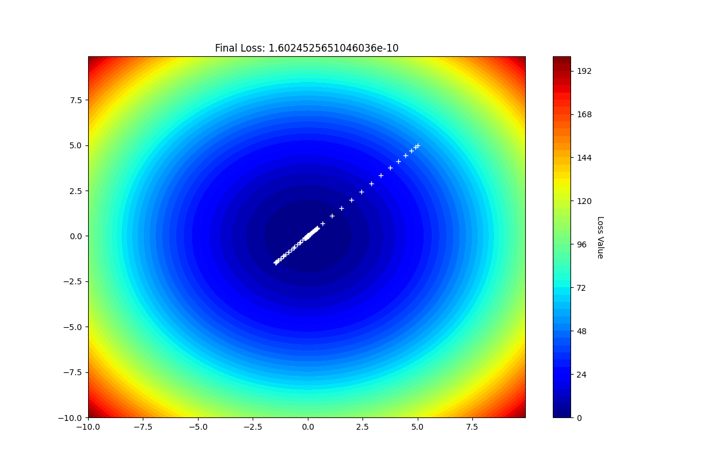
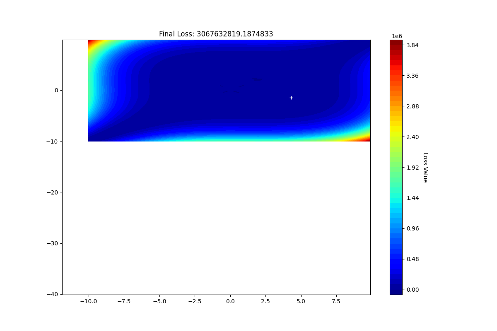
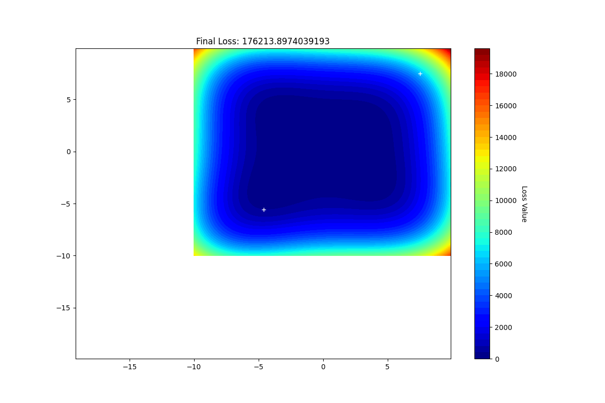

# Title

more complex loss functions and interesting ideas are welcomed.

## Table of Contents
- [Title](#title)
  - [Table of Contents](#table-of-contents)
  - [TODO](#todo)
  - [Some Complex function(x, y) visualization.](#some-complex-functionx-y-visualization)
    - [Formular of the functions](#formular-of-the-functions)
  - [Experiment Result](#experiment-result)
    - [The behavior of different optimizer on those functions.](#the-behavior-of-different-optimizer-on-those-functions)
    - [Different beta value of adam in loss2](#different-beta-value-of-adam-in-loss2)
    - [Different steps in rastrigin of SGD](#different-steps-in-rastrigin-of-sgd)
    - [Different init value of complex](#different-init-value-of-complex)
    - [Different beta value of momentum in himmelblau](#different-beta-value-of-momentum-in-himmelblau)
    - [Different beta value of adam in himmelblau](#different-beta-value-of-adam-in-himmelblau)
    - [Different lr of SGD in mccormick](#different-lr-of-sgd-in-mccormick)
  - [Usage](#usage)
  - [Citation](#citation)
  - [Acknowledgments](#acknowledgments)
  - [Contact With Me](#contact-with-me)
  - [License](#license)


## TODO
- stable the adam optimzier. Exist many numberical problem.
- add Adamw optimizer
- add nestrove optimizer
- generate gif

## Some Complex function(x, y) visualization.

In this repository, I will use the following complex functions to explore the behavior of deffierent optimizer.

| loss1 | loss2 | booth | rastrigin |
|-----|-----|-----|-----|
|  |  |  |  |

| ackley | complex | himmelblau | mccormick |
|-----|-----|-----|-----|
|  |  |  |  |

### Formular of the functions

**loss1**
$$ f(x, y) = x^2 + y^2 $$

**loss2**
\[f(x, y)=0.5x^2 + 10y^2 + x + 2y\]

**booth**:
\[f(x, y) = (x + 2y - 7)^2 + (2x + y - 5)^2\]

**rastrigin**：
\[f(x, y) = 20 + x^2 - 10 \cos(2\pi x) + y^2 - 10 \cos(2\pi y)\]

**ackley**：
\[f(x, y) = -20 \exp\left(-0.2 \sqrt{0.5(x^2 + y^2)}\right) - \exp\left(0.5(\cos(2\pi x) + \cos(2\pi y))\right) + 20 + e\]

**complex**:
\[f(x, y) = (x^3 - 3x^2 + 3y^2 - y^3)^2 + 0.1\cos(5x) + 0.1\sin(5y)\]

**himmelblau**：
\[f(x, y) = (x^2 + y - 11)^2 + (x + y^2 - 7)^2\]

**mccormick**:
\[f(x, y) = \sin(x + y) + (x - y)^2 - 1.5x + 2.5y + 1\]


## Experiment Result

### The behavior of different optimizer on those functions.

**optimizer config**
- config for loss1, loss2, booth:  `lr=0.01, epochs=200, init_x=5, init_y=5, beta in Momentum is 0.9, beta1 in Adam is 0.9, beta2 in Adam is 0.999`.
- config for rastrigin:  `lr=0.01, epochs=300, init_x=5, init_y=5, beta in Momentum is 0.9, beta1 in Adam is 0.9, beta2 in Adam is 0.999`.
- config for ackley:  `lr=0.01, epochs=400, init_x=7.5, init_y=7.5, beta in Momentum is 0.9, beta1 in Adam is 0.9, beta2 in Adam is 0.999`.
- config for complex:  `lr=0.001, epochs=200, init_x=4.3, init_y=-1.5, beta in Momentum is 0.9, beta1 in Adam is 0.9, beta2 in Adam is 0.999`.
- config for himmelblau:  `lr=0.001, epochs=200, init_x=7.5, init_y=7.5, beta in Momentum is 0.9, beta1 in Adam is 0.9, beta2 in Adam is 0.999`.
- config for mccormick: `lr=0.1, epochs=200, init_x=7.5, init_y=7.5` for SGD.  `lr=0.01, epochs=200, init_x=7.5, init_y=7.5, beta in Momentum is 0.9` for Momentum.

|  | SGD | Momentum | Adam |
|-----|-----|-----|-----|
| loss1 | |  |  |
| loss2 | |  |  |
| booth |   |   |   |
| rastrigin |  |  |  |
| ackley |  |  | Fail |
| complex |  |  |  |
| himmelblau |  |  |  |
| mccormick |  |  | TBD |


### Different beta value of adam in loss2

### Different steps in rastrigin of SGD

### Different init value of complex

### Different beta value of momentum in himmelblau

### Different beta value of adam in himmelblau

### Different lr of SGD in mccormick

## Usage

## Citation

```
@misc{xxx,
  author = {Zhongchao, Guan},
  title = {xxx},
  year = {2023},
  publisher = {GitHub},
  journal = {GitHub repository},
  howpublished = {\url{https://github.com/AllenWrong/}},
}
```

## Acknowledgments

- Some content is created with the assistance of ChatGPT.
- 

## Contact With Me

If you are interested in my project or you want to know more about the from scratch series, **follow me on github.**

If you have some ideas youd like to bring to life, **please email me.**

- 📧Email me: [gg884691896@gmail.com](mailto:gg884691896@gmail.com)
- Follow me on [LinkedIn](https://www.linkedin.com/in/zhongchao-guan-aa3288194/).

## License

[](https://github.com/AllenWrong/From-Scratch/learning-rate)