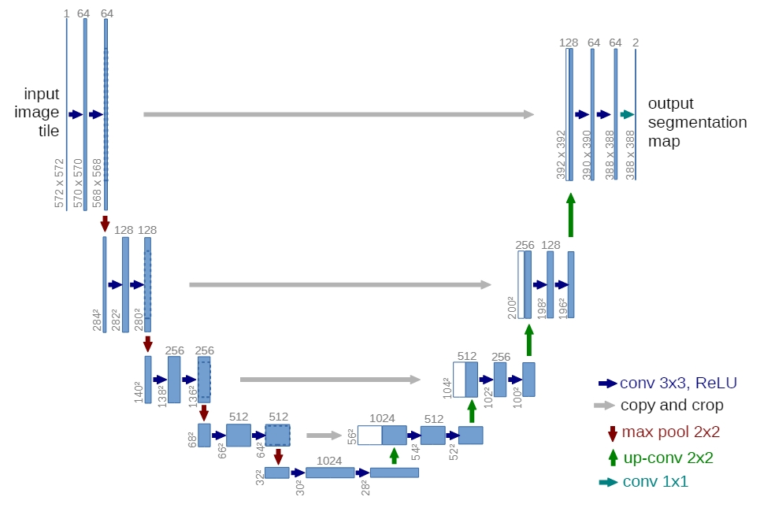
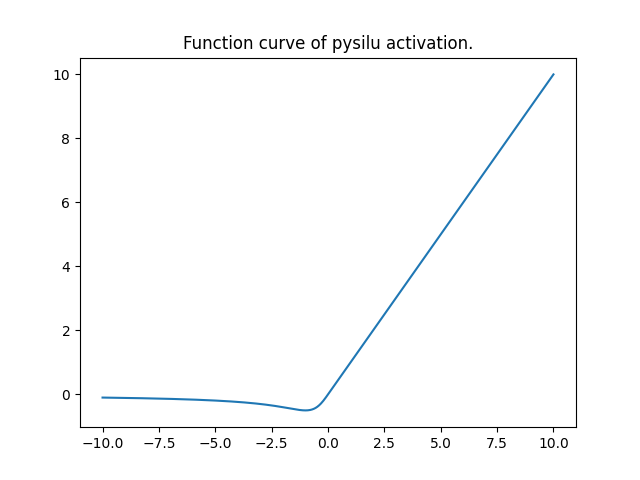
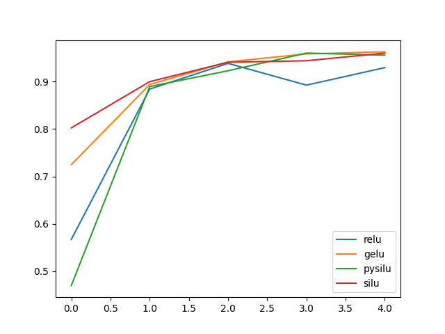
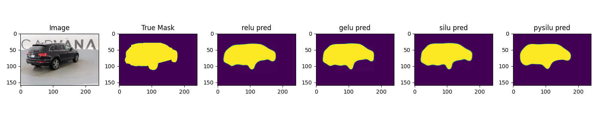
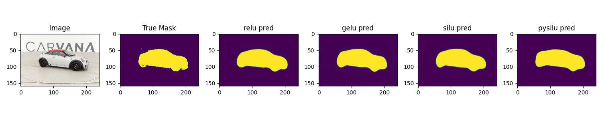
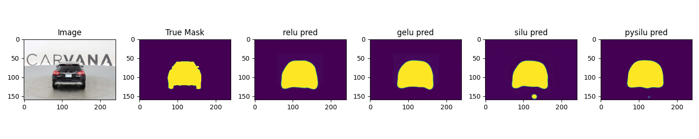

# Implement UNet From Scratch


## Overview
The UNet architecture is a popular choice for image segmentation tasks. This implementation includes training and validation scripts, as well as utilities for data handling and model evaluation.

### Unet Arch
The unet arch is referenced from the origin unet paper. "U-Net:Convolutional Networks for Biomedical Image Segmentation". But there also exists a little difference.

- I **use the same conv** instead of valid-conv in the double-conv-block. This can ensure the output size same as the input size.
- More activation functions are explored here. Such as: relu, gelu, silu. I also **define a new activation function** named 'PySiLU' which mean the polynomial version of silu.
- **Center-Crop is used** in the skip connections between down block and up block.
<p align='center'></p>

### PySiLU activation
This is a activation defined by myself. It has a function curve similar to SiLU.
<p align='center'></p>

The formula of this activation is as follows:

$$pysilu(x) = \begin{cases} 
x & \text{if } x \geq 0 \\
\frac{x}{1+x^2} & \text{if } x < 0 
\end{cases}$$


See the codes in `activation.py`. Uncomment the line `# utils.show_activation_curve(pysilu)`. You can get this figure by run: `python activation.py`

## Requirments

- Python 3.6+
- PyTorch
- Albumentations
- tqdm
- NumPy
- matplotlib
- Pandas

## Usage
1. Clone the reposity:
   ```bash
   git clone ~
   cd Unet-From-Scratch
   ```
2. Install dependecies:
   ```bash
   pip install -r requirements.txt
   ```
3. Download dataset from <a herf="">Kaggle</a>.
4. Prepare you train data and test data with `process_data.py`. This will output two csv file under the data directory(train_desc.csv, test_desc.csv). But you can also use my files.
5. Make necessary directories.
   ```bash
   mkdir imgs
   mkdir metric_logs
   ```
6. Train you model. Check the parameters in `train.py` and then run `python train.py`.

## Some Metrics

### Accuracy
The formula of accuracy is as follows:

$$ acc = \frac{TP+TN}{TP+TN+FP+FN} $$

I assume that you all know this metric. So there is no more introduce about accuracy.

### Dice-score
The formula of accuracy is as follows:

$$ dice=\frac{2\times TP}{2\times TP + FP + FN} $$

Here is a implementation of dice-score with pytorch.

```python
def dice_score(pred, mask):
    up = 2 * (pred * mask).sum()
    down = (pred + mask).sum()
    return up / down
```

The idea is:
- `pred * mask` is the result of 'logical and' of pred and mask. By summing it, you get the `TP` value.
- Give an example: `pred=Tensor([1.0, 1.0, 0.0, 1.0]), mask=Tensor([1.0, 0.0, 0.0, 1.0])`. By excute `pred + mask`, you can get a result `Tensor([2.0, 1.0, 0.0, 2.0])`. If the value of `pred[i]` and `mask[i]` are both `1` (that means this is a true positive case), you can get `2` by executing `pred + mask`. This is sames as `2*TP`. If the value of `pred[i]` and `mask[i]` are both `0` (that means this is a true negative case), you can get `0` which will contribute nothing. But, If the value of `pred[i]` and `mask[i]` is `1` or `0` (that means this is a false positive or false negative case), you can get `1` by executing `pred + mask`. This is same as `FP + FN`. 

## Experiment

### Dice Score
Run experiment 5 epochs with random seed 20. 

| Activation | Train Dice Score | Eval Dice Score |
|:-----:|:----:|:-----------:|
| ReLU| 0.9552 | 0.9295 |
| GeLU| 0.9559 | 0.9629 |
| SiLU| 0.9556 | 0.9601 |
| PySiLU| 0.9545 | 0.9602 |

The figure is dice score curve with different activation function in 5 epochs. **One can see that the ReLU activation function appears to exhibit suboptimal performance.**

<p align="center"></p>

### Inference Visualization
Some inference result visualization.
<p align="center"></p>
<p align="center"></p>
<p align="center"></p>

## Reference
- <a href='https://medium.com/mlearning-ai/understanding-evaluation-metrics-in-medical-image-segmentation-d289a373a3f'>understanding-evaluation-metrics-in-medical-image-segmentation</a>


## Citation
```
@misc{AndrewGuan-UNet,
  author = {Zhongchao, Guan},
  title = {torch-unet-from-Scratch},
  year = {2023},
  publisher = {GitHub},
  journal = {GitHub repository},
  howpublished = {\url{https://github.com/AllenWrong/From-Scratch/unet}},
}
```

## Acknowledgments
- This implementation is based on the UNet architecture.
- The dataset used for training and testing is downloaded from Kaggle <a href="https://www.kaggle.com/c/carvana-image-masking-challenge">Carvana Image Masking Challenge</a>

## Connect With Me

If you are interested in my project or you want to know more about the from scratch series, follow me on github.

If you have some ideas youd like to bring to life, please email me.

- 📧Email me: gg884691896@gmail.com
- Follow me on <a href='https://www.linkedin.com/in/zhongchao-guan-aa3288194/'>LinkedIn</a>.

## Licence
[](https://github.com/AllenWrong/From-Scratch/unet)
